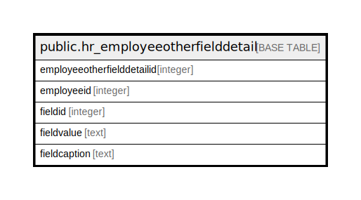

# public.hr_employeeotherfielddetail

## Description

## Columns

| Name | Type | Default | Nullable | Children | Parents | Comment |
| ---- | ---- | ------- | -------- | -------- | ------- | ------- |
| employeeotherfielddetailid | integer | nextval('hr_employeeotherfielddetail_employeeotherfielddetailid_seq'::regclass) | false |  |  |  |
| employeeid | integer |  | true |  |  |  |
| fieldid | integer |  | true |  |  |  |
| fieldvalue | text |  | true |  |  |  |
| fieldcaption | text |  | true |  |  |  |

## Constraints

| Name | Type | Definition |
| ---- | ---- | ---------- |
| hr_employeeotherfielddetail_key | PRIMARY KEY | PRIMARY KEY (employeeotherfielddetailid) |

## Indexes

| Name | Definition |
| ---- | ---------- |
| hr_employeeotherfielddetail_key | CREATE UNIQUE INDEX hr_employeeotherfielddetail_key ON public.hr_employeeotherfielddetail USING btree (employeeotherfielddetailid) |

## Relations

---

> Generated by [tbls](https://github.com/k1LoW/tbls)
