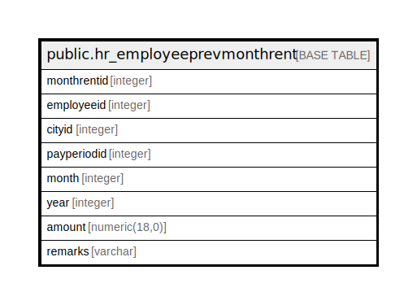

# public.hr_employeeprevmonthrent

## Description

## Columns

| Name | Type | Default | Nullable | Children | Parents | Comment |
| ---- | ---- | ------- | -------- | -------- | ------- | ------- |
| monthrentid | integer | nextval('hr_employeeprevmonthrent_monthrentid_seq'::regclass) | false |  |  |  |
| employeeid | integer |  | true |  |  |  |
| cityid | integer |  | true |  |  |  |
| payperiodid | integer |  | true |  |  |  |
| month | integer |  | true |  |  |  |
| year | integer |  | true |  |  |  |
| amount | numeric(18,0) |  | true |  |  |  |
| remarks | varchar |  | true |  |  |  |

## Constraints

| Name | Type | Definition |
| ---- | ---- | ---------- |
| hr_employeeprevmonthrent_pkey | PRIMARY KEY | PRIMARY KEY (monthrentid) |

## Indexes

| Name | Definition |
| ---- | ---------- |
| hr_employeeprevmonthrent_pkey | CREATE UNIQUE INDEX hr_employeeprevmonthrent_pkey ON public.hr_employeeprevmonthrent USING btree (monthrentid) |

## Relations

---

> Generated by [tbls](https://github.com/k1LoW/tbls)
