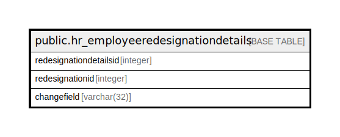

# public.hr_employeeredesignationdetails

## Description

## Columns

| Name | Type | Default | Nullable | Children | Parents | Comment |
| ---- | ---- | ------- | -------- | -------- | ------- | ------- |
| redesignationdetailsid | integer | nextval('hr_employeeredesignationdetails_redesignationdetailsid_seq'::regclass) | false |  |  |  |
| redesignationid | integer |  | true |  |  |  |
| changefield | varchar(32) |  | true |  |  |  |

## Constraints

| Name | Type | Definition |
| ---- | ---- | ---------- |
| hr_employeeredesignationdetail | PRIMARY KEY | PRIMARY KEY (redesignationdetailsid) |

## Indexes

| Name | Definition |
| ---- | ---------- |
| hr_employeeredesignationdetail | CREATE UNIQUE INDEX hr_employeeredesignationdetail ON public.hr_employeeredesignationdetails USING btree (redesignationdetailsid) |

## Relations

---

> Generated by [tbls](https://github.com/k1LoW/tbls)
