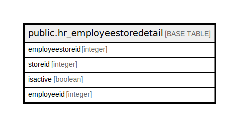

# public.hr_employeestoredetail

## Description

## Columns

| Name | Type | Default | Nullable | Children | Parents | Comment |
| ---- | ---- | ------- | -------- | -------- | ------- | ------- |
| employeestoreid | integer | nextval('hr_employeestoredetail_employeestoreid_seq'::regclass) | false |  |  |  |
| storeid | integer |  | true |  |  |  |
| isactive | boolean |  | true |  |  |  |
| employeeid | integer |  | true |  |  |  |

## Constraints

| Name | Type | Definition |
| ---- | ---- | ---------- |
| hr_employeestoredetail_pkey | PRIMARY KEY | PRIMARY KEY (employeestoreid) |

## Indexes

| Name | Definition |
| ---- | ---------- |
| hr_employeestoredetail_pkey | CREATE UNIQUE INDEX hr_employeestoredetail_pkey ON public.hr_employeestoredetail USING btree (employeestoreid) |

## Relations

---

> Generated by [tbls](https://github.com/k1LoW/tbls)
