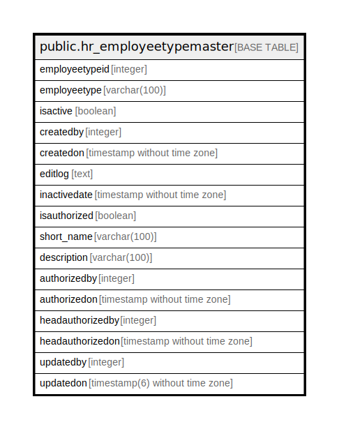

# public.hr_employeetypemaster

## Description

## Columns

| Name | Type | Default | Nullable | Children | Parents | Comment |
| ---- | ---- | ------- | -------- | -------- | ------- | ------- |
| employeetypeid | integer | nextval('hr_employeetypemaster_employeetypeid_seq'::regclass) | false |  |  |  |
| employeetype | varchar(100) |  | true |  |  |  |
| isactive | boolean |  | true |  |  |  |
| createdby | integer |  | true |  |  |  |
| createdon | timestamp without time zone | now() | true |  |  |  |
| editlog | text |  | true |  |  |  |
| inactivedate | timestamp without time zone |  | true |  |  |  |
| isauthorized | boolean | false | true |  |  |  |
| short_name | varchar(100) |  | true |  |  |  |
| description | varchar(100) |  | true |  |  |  |
| authorizedby | integer |  | true |  |  |  |
| authorizedon | timestamp without time zone |  | true |  |  |  |
| headauthorizedby | integer |  | true |  |  |  |
| headauthorizedon | timestamp without time zone |  | true |  |  |  |
| updatedby | integer |  | true |  |  |  |
| updatedon | timestamp(6) without time zone | NULL::timestamp without time zone | true |  |  |  |

## Constraints

| Name | Type | Definition |
| ---- | ---- | ---------- |
| code_employeetype | UNIQUE | UNIQUE (short_name) |
| employeetype | UNIQUE | UNIQUE (employeetype) |
| employeetypemaster_pkey | PRIMARY KEY | PRIMARY KEY (employeetypeid) |

## Indexes

| Name | Definition |
| ---- | ---------- |
| code_employeetype | CREATE UNIQUE INDEX code_employeetype ON public.hr_employeetypemaster USING btree (short_name) |
| employeetype | CREATE UNIQUE INDEX employeetype ON public.hr_employeetypemaster USING btree (employeetype) |
| employeetypemaster_pkey | CREATE UNIQUE INDEX employeetypemaster_pkey ON public.hr_employeetypemaster USING btree (employeetypeid) |

## Relations

---

> Generated by [tbls](https://github.com/k1LoW/tbls)
