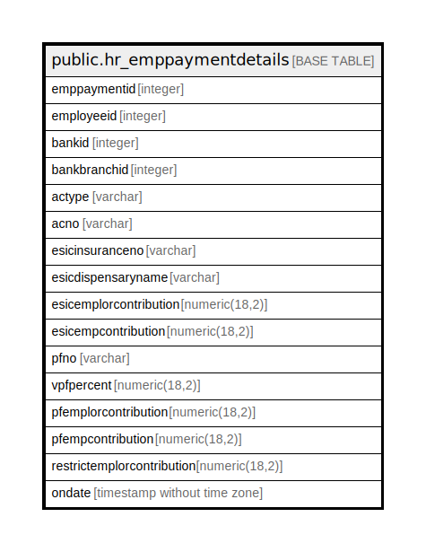

# public.hr_emppaymentdetails

## Description

## Columns

| Name | Type | Default | Nullable | Children | Parents | Comment |
| ---- | ---- | ------- | -------- | -------- | ------- | ------- |
| emppaymentid | integer | nextval('hr_emppaymentdetails_emppaymentid_seq'::regclass) | false |  |  |  |
| employeeid | integer |  | true |  |  |  |
| bankid | integer |  | true |  |  |  |
| bankbranchid | integer |  | true |  |  |  |
| actype | varchar |  | true |  |  |  |
| acno | varchar |  | true |  |  |  |
| esicinsuranceno | varchar |  | true |  |  |  |
| esicdispensaryname | varchar |  | true |  |  |  |
| esicemplorcontribution | numeric(18,2) |  | true |  |  |  |
| esicempcontribution | numeric(18,2) |  | true |  |  |  |
| pfno | varchar |  | true |  |  |  |
| vpfpercent | numeric(18,2) |  | true |  |  |  |
| pfemplorcontribution | numeric(18,2) |  | true |  |  |  |
| pfempcontribution | numeric(18,2) |  | true |  |  |  |
| restrictemplorcontribution | numeric(18,2) |  | true |  |  |  |
| ondate | timestamp without time zone | now() | true |  |  |  |

## Constraints

| Name | Type | Definition |
| ---- | ---- | ---------- |
| hr_emppaymentdetails_pkey | PRIMARY KEY | PRIMARY KEY (emppaymentid) |

## Indexes

| Name | Definition |
| ---- | ---------- |
| hr_emppaymentdetails_pkey | CREATE UNIQUE INDEX hr_emppaymentdetails_pkey ON public.hr_emppaymentdetails USING btree (emppaymentid) |

## Relations

---

> Generated by [tbls](https://github.com/k1LoW/tbls)
