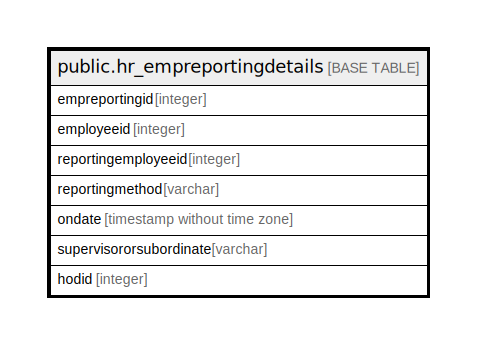

# public.hr_empreportingdetails

## Description

## Columns

| Name | Type | Default | Nullable | Children | Parents | Comment |
| ---- | ---- | ------- | -------- | -------- | ------- | ------- |
| empreportingid | integer | nextval('hr_empreportingdetails_empreportingid_seq'::regclass) | false |  |  |  |
| employeeid | integer |  | true |  |  |  |
| reportingemployeeid | integer |  | true |  |  |  |
| reportingmethod | varchar |  | true |  |  |  |
| ondate | timestamp without time zone | now() | true |  |  |  |
| supervisororsubordinate | varchar |  | true |  |  |  |
| hodid | integer |  | true |  |  |  |

## Constraints

| Name | Type | Definition |
| ---- | ---- | ---------- |
| hr_empreportingdetails_pkey | PRIMARY KEY | PRIMARY KEY (empreportingid) |

## Indexes

| Name | Definition |
| ---- | ---------- |
| hr_empreportingdetails_pkey | CREATE UNIQUE INDEX hr_empreportingdetails_pkey ON public.hr_empreportingdetails USING btree (empreportingid) |

## Relations

---

> Generated by [tbls](https://github.com/k1LoW/tbls)
