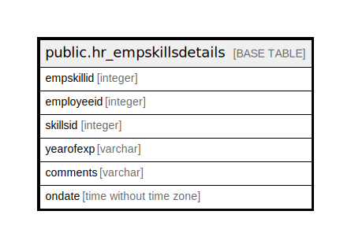

# public.hr_empskillsdetails

## Description

## Columns

| Name | Type | Default | Nullable | Children | Parents | Comment |
| ---- | ---- | ------- | -------- | -------- | ------- | ------- |
| empskillid | integer | nextval('hr_empskillsdetails_empskillid_seq'::regclass) | false |  |  |  |
| employeeid | integer |  | true |  |  |  |
| skillsid | integer |  | true |  |  |  |
| yearofexp | varchar |  | true |  |  |  |
| comments | varchar |  | true |  |  |  |
| ondate | time without time zone | now() | true |  |  |  |

## Constraints

| Name | Type | Definition |
| ---- | ---- | ---------- |
| hr_empskillsdetails_pkey | PRIMARY KEY | PRIMARY KEY (empskillid) |

## Indexes

| Name | Definition |
| ---- | ---------- |
| hr_empskillsdetails_pkey | CREATE UNIQUE INDEX hr_empskillsdetails_pkey ON public.hr_empskillsdetails USING btree (empskillid) |

## Relations

---

> Generated by [tbls](https://github.com/k1LoW/tbls)
