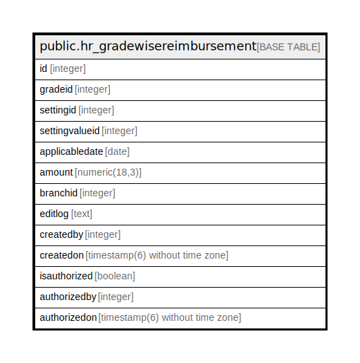

# public.hr_gradewisereimbursement

## Description

## Columns

| Name | Type | Default | Nullable | Children | Parents | Comment |
| ---- | ---- | ------- | -------- | -------- | ------- | ------- |
| id | integer | nextval('hr_gradewisereimbursement_id_seq'::regclass) | false |  |  |  |
| gradeid | integer |  | true |  |  |  |
| settingid | integer |  | true |  |  |  |
| settingvalueid | integer |  | true |  |  |  |
| applicabledate | date |  | true |  |  |  |
| amount | numeric(18,3) |  | true |  |  |  |
| branchid | integer | 0 | true |  |  |  |
| editlog | text |  | true |  |  |  |
| createdby | integer |  | true |  |  |  |
| createdon | timestamp(6) without time zone | now() | true |  |  |  |
| isauthorized | boolean | false | false |  |  |  |
| authorizedby | integer |  | true |  |  |  |
| authorizedon | timestamp(6) without time zone |  | true |  |  |  |

## Constraints

| Name | Type | Definition |
| ---- | ---- | ---------- |
| hr_gradewisereimbursement_pkey | PRIMARY KEY | PRIMARY KEY (id) |

## Indexes

| Name | Definition |
| ---- | ---------- |
| hr_gradewisereimbursement_pkey | CREATE UNIQUE INDEX hr_gradewisereimbursement_pkey ON public.hr_gradewisereimbursement USING btree (id) |

## Relations

---

> Generated by [tbls](https://github.com/k1LoW/tbls)
