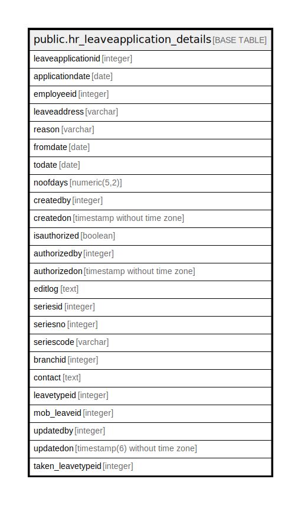

# public.hr_leaveapplication_details

## Description

## Columns

| Name | Type | Default | Nullable | Children | Parents | Comment |
| ---- | ---- | ------- | -------- | -------- | ------- | ------- |
| leaveapplicationid | integer | nextval('hr_leaveapplication_details_leaveapplicationid_seq'::regclass) | false |  |  |  |
| applicationdate | date |  | true |  |  |  |
| employeeid | integer |  | true |  |  |  |
| leaveaddress | varchar |  | true |  |  |  |
| reason | varchar |  | true |  |  |  |
| fromdate | date |  | true |  |  |  |
| todate | date |  | true |  |  |  |
| noofdays | numeric(5,2) |  | true |  |  |  |
| createdby | integer |  | true |  |  |  |
| createdon | timestamp without time zone | now() | true |  |  |  |
| isauthorized | boolean | false | false |  |  |  |
| authorizedby | integer |  | true |  |  |  |
| authorizedon | timestamp without time zone |  | true |  |  |  |
| editlog | text |  | true |  |  |  |
| seriesid | integer |  | true |  |  |  |
| seriesno | integer |  | true |  |  |  |
| seriescode | varchar |  | true |  |  |  |
| branchid | integer |  | true |  |  |  |
| contact | text |  | true |  |  |  |
| leavetypeid | integer |  | true |  |  |  |
| mob_leaveid | integer |  | true |  |  |  |
| updatedby | integer |  | true |  |  |  |
| updatedon | timestamp(6) without time zone | NULL::timestamp without time zone | true |  |  |  |
| taken_leavetypeid | integer | 0 | true |  |  |  |

## Constraints

| Name | Type | Definition |
| ---- | ---- | ---------- |
| hr_leaveapplication_details_pkey | PRIMARY KEY | PRIMARY KEY (leaveapplicationid) |

## Indexes

| Name | Definition |
| ---- | ---------- |
| hr_leaveapplication_details_pkey | CREATE UNIQUE INDEX hr_leaveapplication_details_pkey ON public.hr_leaveapplication_details USING btree (leaveapplicationid) |

## Relations

---

> Generated by [tbls](https://github.com/k1LoW/tbls)
