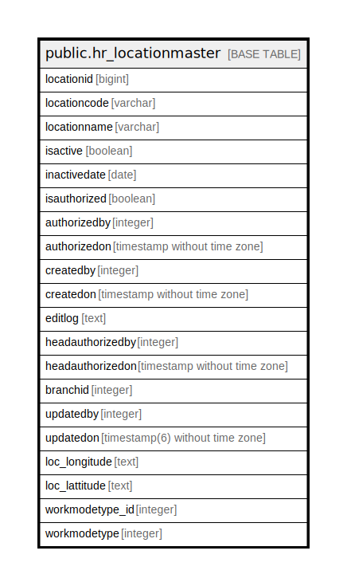

# public.hr_locationmaster

## Description

## Columns

| Name | Type | Default | Nullable | Children | Parents | Comment |
| ---- | ---- | ------- | -------- | -------- | ------- | ------- |
| locationid | bigint | nextval('hr_locationmaster_locationid_seq'::regclass) | false |  |  |  |
| locationcode | varchar |  | false |  |  |  |
| locationname | varchar |  | false |  |  |  |
| isactive | boolean |  | true |  |  |  |
| inactivedate | date |  | true |  |  |  |
| isauthorized | boolean | false | false |  |  |  |
| authorizedby | integer |  | true |  |  |  |
| authorizedon | timestamp without time zone |  | true |  |  |  |
| createdby | integer |  | true |  |  |  |
| createdon | timestamp without time zone | now() | true |  |  |  |
| editlog | text |  | true |  |  |  |
| headauthorizedby | integer |  | true |  |  |  |
| headauthorizedon | timestamp without time zone |  | true |  |  |  |
| branchid | integer |  | true |  |  |  |
| updatedby | integer |  | true |  |  |  |
| updatedon | timestamp(6) without time zone | NULL::timestamp without time zone | true |  |  |  |
| loc_longitude | text |  | true |  |  |  |
| loc_lattitude | text |  | true |  |  |  |
| workmodetype_id | integer | 0 | true |  |  |  |
| workmodetype | integer | 0 | true |  |  |  |

## Constraints

| Name | Type | Definition |
| ---- | ---- | ---------- |
| hr_locationmaster_pkey | PRIMARY KEY | PRIMARY KEY (locationid) |

## Indexes

| Name | Definition |
| ---- | ---------- |
| hr_locationmaster_pkey | CREATE UNIQUE INDEX hr_locationmaster_pkey ON public.hr_locationmaster USING btree (locationid) |
| uq_locationcode | CREATE UNIQUE INDEX uq_locationcode ON public.hr_locationmaster USING btree (lower((locationcode)::text)) |
| uq_locationname | CREATE UNIQUE INDEX uq_locationname ON public.hr_locationmaster USING btree (lower((locationname)::text)) |

## Relations

---

> Generated by [tbls](https://github.com/k1LoW/tbls)
