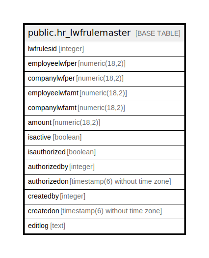

# public.hr_lwfrulemaster

## Description

## Columns

| Name | Type | Default | Nullable | Children | Parents | Comment |
| ---- | ---- | ------- | -------- | -------- | ------- | ------- |
| lwfrulesid | integer | nextval('hr_lwfrulemaster_lwfrulesid_seq'::regclass) | false |  |  |  |
| employeelwfper | numeric(18,2) |  | true |  |  |  |
| companylwfper | numeric(18,2) |  | true |  |  |  |
| employeelwfamt | numeric(18,2) |  | true |  |  |  |
| companylwfamt | numeric(18,2) |  | true |  |  |  |
| amount | numeric(18,2) |  | true |  |  |  |
| isactive | boolean | false | false |  |  |  |
| isauthorized | boolean | false | false |  |  |  |
| authorizedby | integer |  | true |  |  |  |
| authorizedon | timestamp(6) without time zone |  | true |  |  |  |
| createdby | integer |  | true |  |  |  |
| createdon | timestamp(6) without time zone | now() | true |  |  |  |
| editlog | text |  | true |  |  |  |

## Relations

---

> Generated by [tbls](https://github.com/k1LoW/tbls)
