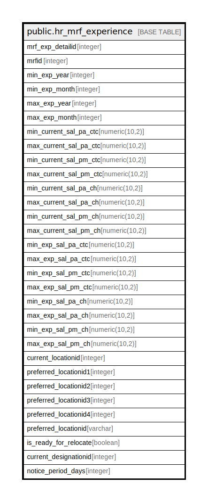

# public.hr_mrf_experience

## Description

## Columns

| Name | Type | Default | Nullable | Children | Parents | Comment |
| ---- | ---- | ------- | -------- | -------- | ------- | ------- |
| mrf_exp_detailid | integer | nextval('hr_mrf_experience_mrf_exp_detailid_seq'::regclass) | false |  |  |  |
| mrfid | integer |  | false |  |  |  |
| min_exp_year | integer |  | false |  |  |  |
| min_exp_month | integer |  | false |  |  |  |
| max_exp_year | integer |  | false |  |  |  |
| max_exp_month | integer |  | false |  |  |  |
| min_current_sal_pa_ctc | numeric(10,2) |  | true |  |  |  |
| max_current_sal_pa_ctc | numeric(10,2) |  | true |  |  |  |
| min_current_sal_pm_ctc | numeric(10,2) |  | true |  |  |  |
| max_current_sal_pm_ctc | numeric(10,2) |  | true |  |  |  |
| min_current_sal_pa_ch | numeric(10,2) |  | true |  |  |  |
| max_current_sal_pa_ch | numeric(10,2) |  | true |  |  |  |
| min_current_sal_pm_ch | numeric(10,2) |  | true |  |  |  |
| max_current_sal_pm_ch | numeric(10,2) |  | true |  |  |  |
| min_exp_sal_pa_ctc | numeric(10,2) |  | false |  |  |  |
| max_exp_sal_pa_ctc | numeric(10,2) |  | false |  |  |  |
| min_exp_sal_pm_ctc | numeric(10,2) |  | false |  |  |  |
| max_exp_sal_pm_ctc | numeric(10,2) |  | false |  |  |  |
| min_exp_sal_pa_ch | numeric(10,2) |  | false |  |  |  |
| max_exp_sal_pa_ch | numeric(10,2) |  | false |  |  |  |
| min_exp_sal_pm_ch | numeric(10,2) |  | false |  |  |  |
| max_exp_sal_pm_ch | numeric(10,2) |  | false |  |  |  |
| current_locationid | integer |  | false |  |  |  |
| preferred_locationid1 | integer |  | true |  |  |  |
| preferred_locationid2 | integer |  | true |  |  |  |
| preferred_locationid3 | integer |  | true |  |  |  |
| preferred_locationid4 | integer |  | true |  |  |  |
| preferred_locationid | varchar |  | true |  |  |  |
| is_ready_for_relocate | boolean | false | false |  |  |  |
| current_designationid | integer |  | false |  |  |  |
| notice_period_days | integer |  | false |  |  |  |

## Constraints

| Name | Type | Definition |
| ---- | ---- | ---------- |
| hr_mrf_experience_pkey | PRIMARY KEY | PRIMARY KEY (mrf_exp_detailid) |

## Indexes

| Name | Definition |
| ---- | ---------- |
| hr_mrf_experience_pkey | CREATE UNIQUE INDEX hr_mrf_experience_pkey ON public.hr_mrf_experience USING btree (mrf_exp_detailid) |

## Relations

---

> Generated by [tbls](https://github.com/k1LoW/tbls)
