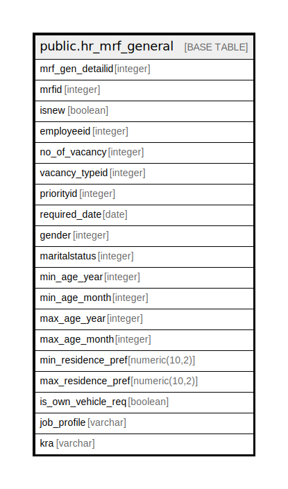

# public.hr_mrf_general

## Description

## Columns

| Name | Type | Default | Nullable | Children | Parents | Comment |
| ---- | ---- | ------- | -------- | -------- | ------- | ------- |
| mrf_gen_detailid | integer | nextval('hr_mrf_general_mrf_gen_detailid_seq'::regclass) | false |  |  |  |
| mrfid | integer |  | false |  |  |  |
| isnew | boolean | false | true |  |  |  |
| employeeid | integer |  | true |  |  |  |
| no_of_vacancy | integer |  | true |  |  |  |
| vacancy_typeid | integer |  | true |  |  |  |
| priorityid | integer |  | true |  |  |  |
| required_date | date |  | true |  |  |  |
| gender | integer |  | true |  |  |  |
| maritalstatus | integer |  | true |  |  |  |
| min_age_year | integer |  | true |  |  |  |
| min_age_month | integer |  | true |  |  |  |
| max_age_year | integer |  | true |  |  |  |
| max_age_month | integer |  | true |  |  |  |
| min_residence_pref | numeric(10,2) |  | true |  |  |  |
| max_residence_pref | numeric(10,2) |  | true |  |  |  |
| is_own_vehicle_req | boolean |  | true |  |  |  |
| job_profile | varchar |  | true |  |  |  |
| kra | varchar |  | true |  |  |  |

## Constraints

| Name | Type | Definition |
| ---- | ---- | ---------- |
| hr_mrf_general_pkey | PRIMARY KEY | PRIMARY KEY (mrf_gen_detailid) |

## Indexes

| Name | Definition |
| ---- | ---------- |
| hr_mrf_general_pkey | CREATE UNIQUE INDEX hr_mrf_general_pkey ON public.hr_mrf_general USING btree (mrf_gen_detailid) |

## Relations

---

> Generated by [tbls](https://github.com/k1LoW/tbls)
