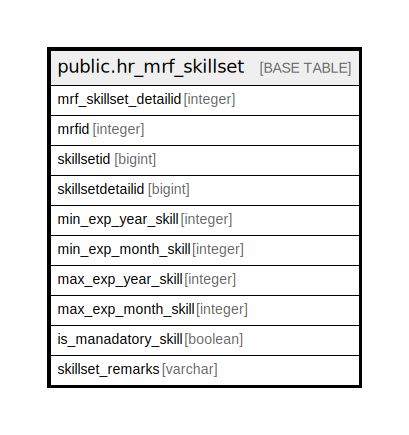

# public.hr_mrf_skillset

## Description

## Columns

| Name | Type | Default | Nullable | Children | Parents | Comment |
| ---- | ---- | ------- | -------- | -------- | ------- | ------- |
| mrf_skillset_detailid | integer | nextval('hr_mrf_skillset_mrf_skillset_detailid_seq'::regclass) | false |  |  |  |
| mrfid | integer |  | false |  |  |  |
| skillsetid | bigint |  | true |  |  |  |
| skillsetdetailid | bigint |  | true |  |  |  |
| min_exp_year_skill | integer |  | true |  |  |  |
| min_exp_month_skill | integer |  | true |  |  |  |
| max_exp_year_skill | integer |  | true |  |  |  |
| max_exp_month_skill | integer |  | true |  |  |  |
| is_manadatory_skill | boolean | false | true |  |  |  |
| skillset_remarks | varchar |  | true |  |  |  |

## Constraints

| Name | Type | Definition |
| ---- | ---- | ---------- |
| hr_mrf_skillset_pkey | PRIMARY KEY | PRIMARY KEY (mrf_skillset_detailid) |

## Indexes

| Name | Definition |
| ---- | ---------- |
| hr_mrf_skillset_pkey | CREATE UNIQUE INDEX hr_mrf_skillset_pkey ON public.hr_mrf_skillset USING btree (mrf_skillset_detailid) |

## Relations

---

> Generated by [tbls](https://github.com/k1LoW/tbls)
