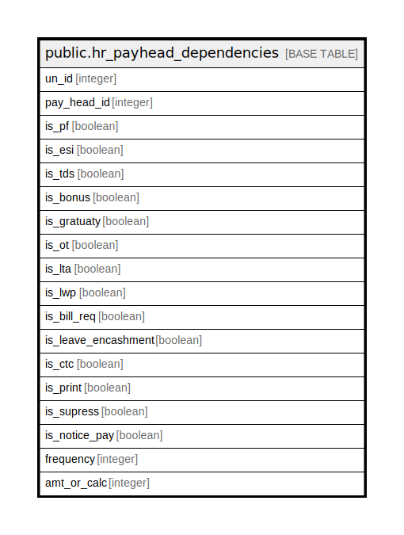

# public.hr_payhead_dependencies

## Description

## Columns

| Name | Type | Default | Nullable | Children | Parents | Comment |
| ---- | ---- | ------- | -------- | -------- | ------- | ------- |
| un_id | integer | nextval('hr_payhead_dependencies_un_id_seq'::regclass) | false |  |  |  |
| pay_head_id | integer |  | false |  |  |  |
| is_pf | boolean | false | true |  |  |  |
| is_esi | boolean | false | true |  |  |  |
| is_tds | boolean | false | true |  |  |  |
| is_bonus | boolean | false | true |  |  |  |
| is_gratuaty | boolean | false | true |  |  |  |
| is_ot | boolean | false | true |  |  |  |
| is_lta | boolean | false | true |  |  |  |
| is_lwp | boolean | false | true |  |  |  |
| is_bill_req | boolean | false | true |  |  |  |
| is_leave_encashment | boolean | false | true |  |  |  |
| is_ctc | boolean | false | true |  |  |  |
| is_print | boolean | false | true |  |  |  |
| is_supress | boolean | false | true |  |  |  |
| is_notice_pay | boolean | false | true |  |  |  |
| frequency | integer |  | true |  |  | From Setting ID=42 and settingvalueid= 1 and 4 |
| amt_or_calc | integer |  | false |  |  | From Setting ID=71 |

## Constraints

| Name | Type | Definition |
| ---- | ---- | ---------- |
| hr_payhead_dependencies_pkey | PRIMARY KEY | PRIMARY KEY (un_id) |

## Indexes

| Name | Definition |
| ---- | ---------- |
| hr_payhead_dependencies_pkey | CREATE UNIQUE INDEX hr_payhead_dependencies_pkey ON public.hr_payhead_dependencies USING btree (un_id) |

## Relations

---

> Generated by [tbls](https://github.com/k1LoW/tbls)
