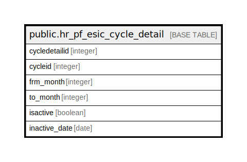

# public.hr_pf_esic_cycle_detail

## Description

## Columns

| Name | Type | Default | Nullable | Children | Parents | Comment |
| ---- | ---- | ------- | -------- | -------- | ------- | ------- |
| cycledetailid | integer | nextval('hr_pf_esic_cycle_detail_cycledetailid_seq1'::regclass) | false |  |  |  |
| cycleid | integer |  | false |  |  |  |
| frm_month | integer |  | false |  |  |  |
| to_month | integer |  | false |  |  |  |
| isactive | boolean |  | true |  |  |  |
| inactive_date | date |  | true |  |  |  |

## Constraints

| Name | Type | Definition |
| ---- | ---- | ---------- |
| hr_pf_esic_cycle_detail_pkey | PRIMARY KEY | PRIMARY KEY (cycledetailid) |

## Indexes

| Name | Definition |
| ---- | ---------- |
| hr_pf_esic_cycle_detail_pkey | CREATE UNIQUE INDEX hr_pf_esic_cycle_detail_pkey ON public.hr_pf_esic_cycle_detail USING btree (cycledetailid) |

## Relations

---

> Generated by [tbls](https://github.com/k1LoW/tbls)
