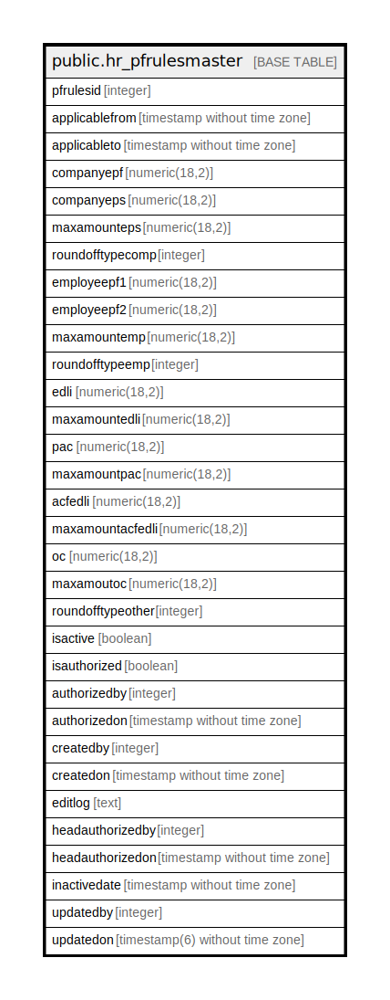

# public.hr_pfrulesmaster

## Description

## Columns

| Name | Type | Default | Nullable | Children | Parents | Comment |
| ---- | ---- | ------- | -------- | -------- | ------- | ------- |
| pfrulesid | integer | nextval('hr_pfrulesmaster_pfrulesid_seq'::regclass) | false |  |  |  |
| applicablefrom | timestamp without time zone |  | true |  |  |  |
| applicableto | timestamp without time zone |  | true |  |  |  |
| companyepf | numeric(18,2) |  | true |  |  |  |
| companyeps | numeric(18,2) |  | true |  |  |  |
| maxamounteps | numeric(18,2) |  | true |  |  |  |
| roundofftypecomp | integer |  | true |  |  |  |
| employeepf1 | numeric(18,2) |  | true |  |  |  |
| employeepf2 | numeric(18,2) |  | true |  |  |  |
| maxamountemp | numeric(18,2) |  | true |  |  |  |
| roundofftypeemp | integer |  | true |  |  |  |
| edli | numeric(18,2) |  | true |  |  |  |
| maxamountedli | numeric(18,2) |  | true |  |  |  |
| pac | numeric(18,2) |  | true |  |  |  |
| maxamountpac | numeric(18,2) |  | true |  |  |  |
| acfedli | numeric(18,2) |  | true |  |  |  |
| maxamountacfedli | numeric(18,2) |  | true |  |  |  |
| oc | numeric(18,2) |  | true |  |  |  |
| maxamoutoc | numeric(18,2) |  | true |  |  |  |
| roundofftypeother | integer |  | true |  |  |  |
| isactive | boolean | false | false |  |  |  |
| isauthorized | boolean | false | false |  |  |  |
| authorizedby | integer |  | true |  |  |  |
| authorizedon | timestamp without time zone |  | true |  |  |  |
| createdby | integer |  | true |  |  |  |
| createdon | timestamp without time zone | now() | true |  |  |  |
| editlog | text |  | true |  |  |  |
| headauthorizedby | integer |  | true |  |  |  |
| headauthorizedon | timestamp without time zone |  | true |  |  |  |
| inactivedate | timestamp without time zone |  | true |  |  |  |
| updatedby | integer |  | true |  |  |  |
| updatedon | timestamp(6) without time zone | NULL::timestamp without time zone | true |  |  |  |

## Constraints

| Name | Type | Definition |
| ---- | ---- | ---------- |
| pfrules_pkey | PRIMARY KEY | PRIMARY KEY (pfrulesid) |

## Indexes

| Name | Definition |
| ---- | ---------- |
| pfrules_pkey | CREATE UNIQUE INDEX pfrules_pkey ON public.hr_pfrulesmaster USING btree (pfrulesid) |

## Relations

---

> Generated by [tbls](https://github.com/k1LoW/tbls)
