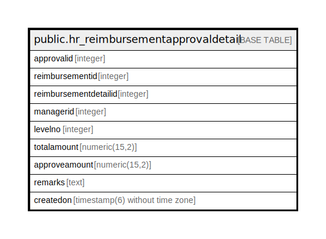

# public.hr_reimbursementapprovaldetail

## Description

## Columns

| Name | Type | Default | Nullable | Children | Parents | Comment |
| ---- | ---- | ------- | -------- | -------- | ------- | ------- |
| approvalid | integer | nextval('hr_reimbursementapprovaldetail_approvalid_seq'::regclass) | false |  |  |  |
| reimbursementid | integer |  | true |  |  |  |
| reimbursementdetailid | integer |  | true |  |  |  |
| managerid | integer |  | true |  |  |  |
| levelno | integer |  | true |  |  |  |
| totalamount | numeric(15,2) |  | true |  |  |  |
| approveamount | numeric(15,2) |  | true |  |  |  |
| remarks | text |  | true |  |  |  |
| createdon | timestamp(6) without time zone | now() | true |  |  |  |

## Constraints

| Name | Type | Definition |
| ---- | ---- | ---------- |
| hr_reimbursementapprovaldetail_pkey | PRIMARY KEY | PRIMARY KEY (approvalid) |

## Indexes

| Name | Definition |
| ---- | ---------- |
| hr_reimbursementapprovaldetail_pkey | CREATE UNIQUE INDEX hr_reimbursementapprovaldetail_pkey ON public.hr_reimbursementapprovaldetail USING btree (approvalid) |

## Relations

---

> Generated by [tbls](https://github.com/k1LoW/tbls)
