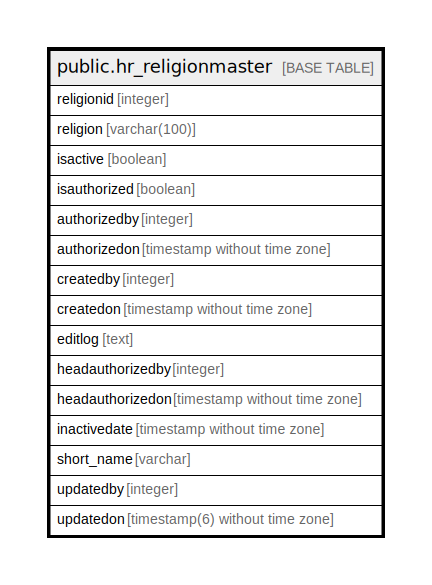

# public.hr_religionmaster

## Description

## Columns

| Name | Type | Default | Nullable | Children | Parents | Comment |
| ---- | ---- | ------- | -------- | -------- | ------- | ------- |
| religionid | integer | nextval('hr_religionmaster_religionid_seq'::regclass) | false |  |  |  |
| religion | varchar(100) |  | false |  |  |  |
| isactive | boolean |  | true |  |  |  |
| isauthorized | boolean | false | false |  |  |  |
| authorizedby | integer |  | true |  |  |  |
| authorizedon | timestamp without time zone |  | true |  |  |  |
| createdby | integer |  | true |  |  |  |
| createdon | timestamp without time zone | now() | true |  |  |  |
| editlog | text |  | true |  |  |  |
| headauthorizedby | integer |  | true |  |  |  |
| headauthorizedon | timestamp without time zone |  | true |  |  |  |
| inactivedate | timestamp without time zone |  | true |  |  |  |
| short_name | varchar |  | true |  |  |  |
| updatedby | integer |  | true |  |  |  |
| updatedon | timestamp(6) without time zone | NULL::timestamp without time zone | true |  |  |  |

## Constraints

| Name | Type | Definition |
| ---- | ---- | ---------- |
| code_religion | UNIQUE | UNIQUE (short_name) |
| hr_religionmaster_pkey | PRIMARY KEY | PRIMARY KEY (religionid) |
| religion | UNIQUE | UNIQUE (religion) |

## Indexes

| Name | Definition |
| ---- | ---------- |
| code_religion | CREATE UNIQUE INDEX code_religion ON public.hr_religionmaster USING btree (short_name) |
| hr_religionmaster_pkey | CREATE UNIQUE INDEX hr_religionmaster_pkey ON public.hr_religionmaster USING btree (religionid) |
| religion | CREATE UNIQUE INDEX religion ON public.hr_religionmaster USING btree (religion) |

## Relations

---

> Generated by [tbls](https://github.com/k1LoW/tbls)
