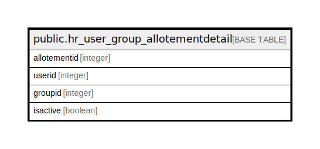

# public.hr_user_group_allotementdetail

## Description

## Columns

| Name | Type | Default | Nullable | Children | Parents | Comment |
| ---- | ---- | ------- | -------- | -------- | ------- | ------- |
| allotementid | integer | nextval('hr_user_group_allotementdetail_allotementid_seq'::regclass) | false |  |  |  |
| userid | integer |  | true |  |  |  |
| groupid | integer |  | true |  |  |  |
| isactive | boolean |  | true |  |  |  |

## Constraints

| Name | Type | Definition |
| ---- | ---- | ---------- |
| hr_user_group_allotementdetail_pkey | PRIMARY KEY | PRIMARY KEY (allotementid) |

## Indexes

| Name | Definition |
| ---- | ---------- |
| hr_user_group_allotementdetail_pkey | CREATE UNIQUE INDEX hr_user_group_allotementdetail_pkey ON public.hr_user_group_allotementdetail USING btree (allotementid) |

## Relations

---

> Generated by [tbls](https://github.com/k1LoW/tbls)
