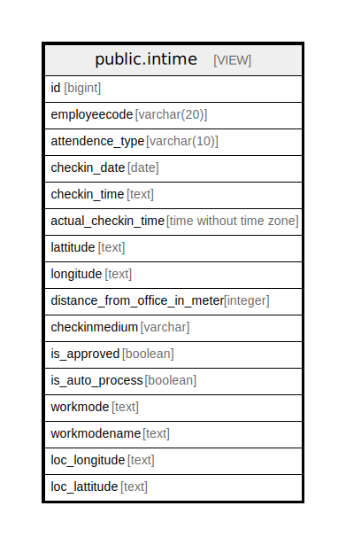

# public.intime

## Description

<details>
<summary><strong>Table Definition</strong></summary>

```sql
CREATE VIEW intime AS (
 SELECT row_number() OVER (PARTITION BY attendence.employeecode, attendence.attendencetype ORDER BY attendence.time_stamp) AS id,
    attendence.employeecode,
    attendence.attendencetype AS attendence_type,
    (attendence.time_stamp)::date AS checkin_date,
    to_char(((attendence.time_stamp)::time without time zone)::interval, 'HH12:MI:SS AM'::text) AS checkin_time,
    (attendence.time_stamp)::time without time zone AS actual_checkin_time,
    attendence.lattitude,
    attendence.longitude,
    attendence.distance_from_office_in_meter,
        CASE
            WHEN (attendence.is_auto_process = true) THEN 'Auto'::character varying
            ELSE attendence.medium
        END AS checkinmedium,
    COALESCE(attendence.is_approved, false) AS is_approved,
    COALESCE(attendence.is_auto_process, false) AS is_auto_process,
        CASE
            WHEN (attendence.workmodetype = 'location'::text) THEN 'Branch Office'::text
            WHEN (attendence.workmodetype = 'client'::text) THEN 'Client'::text
            WHEN (attendence.workmodetype = 'ho'::text) THEN 'Head Office'::text
            WHEN (attendence.workmodetype = 'presenthome'::text) THEN 'Temporary Home'::text
            WHEN (attendence.workmodetype = 'permanenthome'::text) THEN 'Permanent Home'::text
            ELSE 'N/A'::text
        END AS workmode,
    (
        CASE
            WHEN (attendence.workmodetype = 'location'::text) THEN locm.locationname
            WHEN (attendence.workmodetype = 'client'::text) THEN pm.partyname
            ELSE 'N/A'::character varying
        END)::text AS workmodename,
    attendence.loc_longitude,
    attendence.loc_lattitude
   FROM (((mob_attendence attendence
     JOIN ( SELECT attendence_1.employeecode,
            min(attendence_1.attendenceid) AS attendenceid,
            (attendence_1.time_stamp)::date AS time_stamp
           FROM mob_attendence attendence_1
          WHERE ((attendence_1.attendencetype)::text = 'IN'::text)
          GROUP BY attendence_1.employeecode, ((attendence_1.time_stamp)::date)) z ON ((attendence.attendenceid = z.attendenceid)))
     LEFT JOIN hr_locationmaster locm ON ((locm.locationid = attendence.workmodetype_id)))
     LEFT JOIN comn_partymaster pm ON ((pm.partyid = attendence.workmodetype_id)))
  WHERE ((attendence.attendencetype)::text = 'IN'::text)
  ORDER BY attendence.employeecode
)
```

</details>

## Columns

| Name | Type | Default | Nullable | Children | Parents | Comment |
| ---- | ---- | ------- | -------- | -------- | ------- | ------- |
| id | bigint |  | true |  |  |  |
| employeecode | varchar(20) |  | true |  |  |  |
| attendence_type | varchar(10) |  | true |  |  |  |
| checkin_date | date |  | true |  |  |  |
| checkin_time | text |  | true |  |  |  |
| actual_checkin_time | time without time zone |  | true |  |  |  |
| lattitude | text |  | true |  |  |  |
| longitude | text |  | true |  |  |  |
| distance_from_office_in_meter | integer |  | true |  |  |  |
| checkinmedium | varchar |  | true |  |  |  |
| is_approved | boolean |  | true |  |  |  |
| is_auto_process | boolean |  | true |  |  |  |
| workmode | text |  | true |  |  |  |
| workmodename | text |  | true |  |  |  |
| loc_longitude | text |  | true |  |  |  |
| loc_lattitude | text |  | true |  |  |  |

## Referenced Tables

| Name | Columns | Comment | Type |
| ---- | ------- | ------- | ---- |
| [public.mob_attendence](public.mob_attendence.md) | 19 |  | BASE TABLE |
| [public.hr_locationmaster](public.hr_locationmaster.md) | 20 |  | BASE TABLE |
| [public.comn_partymaster](public.comn_partymaster.md) | 120 |  | BASE TABLE |

## Relations



---

> Generated by [tbls](https://github.com/k1LoW/tbls)
