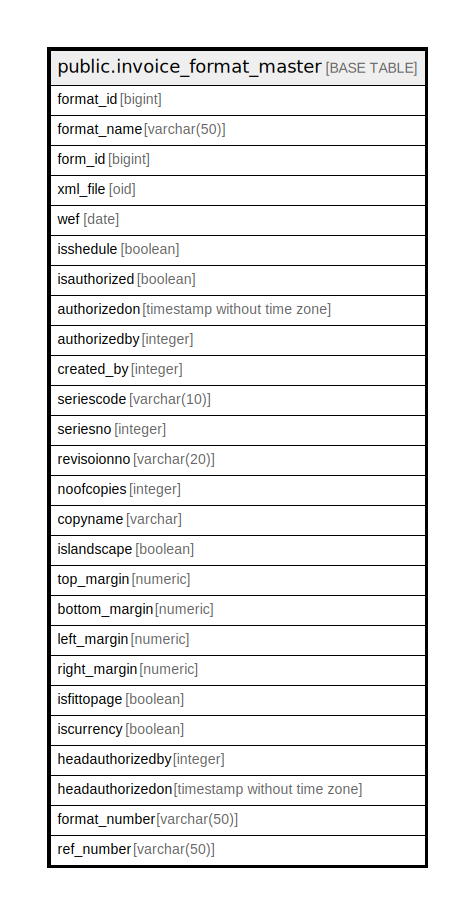

# public.invoice_format_master

## Description

## Columns

| Name | Type | Default | Nullable | Children | Parents | Comment |
| ---- | ---- | ------- | -------- | -------- | ------- | ------- |
| format_id | bigint | nextval('invoice_format_master_format_id_seq'::regclass) | false |  |  |  |
| format_name | varchar(50) |  | true |  |  |  |
| form_id | bigint |  | true |  |  |  |
| xml_file | oid |  | true |  |  |  |
| wef | date |  | true |  |  |  |
| isshedule | boolean | false | true |  |  |  |
| isauthorized | boolean | false | true |  |  |  |
| authorizedon | timestamp without time zone |  | true |  |  |  |
| authorizedby | integer |  | true |  |  |  |
| created_by | integer |  | true |  |  |  |
| seriescode | varchar(10) |  | true |  |  |  |
| seriesno | integer |  | true |  |  |  |
| revisoionno | varchar(20) |  | true |  |  |  |
| noofcopies | integer | 1 | true |  |  |  |
| copyname | varchar |  | true |  |  |  |
| islandscape | boolean | false | true |  |  |  |
| top_margin | numeric | 1 | true |  |  |  |
| bottom_margin | numeric | 1 | true |  |  |  |
| left_margin | numeric | 1 | true |  |  |  |
| right_margin | numeric | 1 | true |  |  |  |
| isfittopage | boolean | false | true |  |  |  |
| iscurrency | boolean | false | true |  |  |  |
| headauthorizedby | integer |  | true |  |  |  |
| headauthorizedon | timestamp without time zone |  | true |  |  |  |
| format_number | varchar(50) |  | true |  |  |  |
| ref_number | varchar(50) |  | true |  |  |  |

## Constraints

| Name | Type | Definition |
| ---- | ---- | ---------- |
| invoice_format_master_pkey | PRIMARY KEY | PRIMARY KEY (format_id) |

## Indexes

| Name | Definition |
| ---- | ---------- |
| invoice_format_master_pkey | CREATE UNIQUE INDEX invoice_format_master_pkey ON public.invoice_format_master USING btree (format_id) |

## Relations

---

> Generated by [tbls](https://github.com/k1LoW/tbls)
