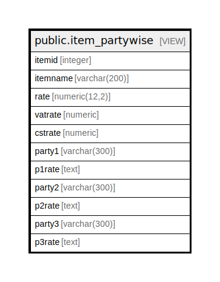

# public.item_partywise

## Description

<details>
<summary><strong>Table Definition</strong></summary>

```sql
CREATE VIEW item_partywise AS (
 SELECT stor_itemmaster.itemid,
    stor_itemmaster.itemname,
    stor_itemmaster.rate,
    COALESCE(stor_itemmaster.vatrate, (0)::numeric) AS vatrate,
    COALESCE(stor_itemmaster.cstrate, (0)::numeric) AS cstrate,
    fparty.partyname AS party1,
    ((((fparty.partyname)::text || ' ['::text) || fp.partyitemrate) || ']'::text) AS p1rate,
    sparty.partyname AS party2,
    ((((sparty.partyname)::text || ' ['::text) || sp.partyitemrate) || ']'::text) AS p2rate,
    tparty.partyname AS party3,
    ((((tparty.partyname)::text || ' ['::text) || tp.partyitemrate) || ']'::text) AS p3rate
   FROM ((((((stor_itemmaster
     LEFT JOIN stor_itemsupplierpriority fp ON (((stor_itemmaster.itemid = fp.itemid) AND (fp.priority = 1))))
     LEFT JOIN stor_itemsupplierpriority sp ON (((stor_itemmaster.itemid = sp.itemid) AND (sp.priority = 2))))
     LEFT JOIN stor_itemsupplierpriority tp ON (((stor_itemmaster.itemid = tp.itemid) AND (tp.priority = 3))))
     LEFT JOIN comn_partymaster fparty ON ((fp.partyid = fparty.partyid)))
     LEFT JOIN comn_partymaster sparty ON ((sp.partyid = sparty.partyid)))
     LEFT JOIN comn_partymaster tparty ON ((tp.partyid = tparty.partyid)))
)
```

</details>

## Columns

| Name | Type | Default | Nullable | Children | Parents | Comment |
| ---- | ---- | ------- | -------- | -------- | ------- | ------- |
| itemid | integer |  | true |  |  |  |
| itemname | varchar(200) |  | true |  |  |  |
| rate | numeric(12,2) |  | true |  |  |  |
| vatrate | numeric |  | true |  |  |  |
| cstrate | numeric |  | true |  |  |  |
| party1 | varchar(300) |  | true |  |  |  |
| p1rate | text |  | true |  |  |  |
| party2 | varchar(300) |  | true |  |  |  |
| p2rate | text |  | true |  |  |  |
| party3 | varchar(300) |  | true |  |  |  |
| p3rate | text |  | true |  |  |  |

## Referenced Tables

| Name | Columns | Comment | Type |
| ---- | ------- | ------- | ---- |
| [public.stor_itemmaster](public.stor_itemmaster.md) | 178 |  | BASE TABLE |
| [public.stor_itemsupplierpriority](public.stor_itemsupplierpriority.md) | 6 |  | BASE TABLE |
| [public.comn_partymaster](public.comn_partymaster.md) | 120 |  | BASE TABLE |

## Relations



---

> Generated by [tbls](https://github.com/k1LoW/tbls)
