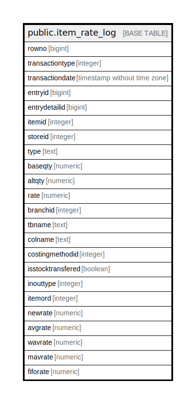

# public.item_rate_log

## Description

## Columns

| Name | Type | Default | Nullable | Children | Parents | Comment |
| ---- | ---- | ------- | -------- | -------- | ------- | ------- |
| rowno | bigint |  | true |  |  |  |
| transactiontype | integer |  | true |  |  |  |
| transactiondate | timestamp without time zone |  | true |  |  |  |
| entryid | bigint |  | true |  |  |  |
| entrydetailid | bigint |  | true |  |  |  |
| itemid | integer |  | true |  |  |  |
| storeid | integer |  | true |  |  |  |
| type | text |  | true |  |  |  |
| baseqty | numeric |  | true |  |  |  |
| altqty | numeric |  | true |  |  |  |
| rate | numeric |  | true |  |  |  |
| branchid | integer |  | true |  |  |  |
| tbname | text |  | true |  |  |  |
| colname | text |  | true |  |  |  |
| costingmethodid | integer |  | true |  |  |  |
| isstocktransfered | boolean |  | true |  |  |  |
| inouttype | integer |  | true |  |  |  |
| itemord | integer |  | true |  |  |  |
| newrate | numeric |  | true |  |  |  |
| avgrate | numeric |  | true |  |  |  |
| wavrate | numeric |  | true |  |  |  |
| mavrate | numeric |  | true |  |  |  |
| fiforate | numeric |  | true |  |  |  |

## Relations

---

> Generated by [tbls](https://github.com/k1LoW/tbls)
