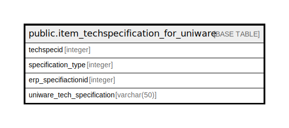

# public.item_techspecification_for_uniware

## Description

## Columns

| Name | Type | Default | Nullable | Children | Parents | Comment |
| ---- | ---- | ------- | -------- | -------- | ------- | ------- |
| techspecid | integer | nextval('item_techspecification_for_uniware_techspecid_seq'::regclass) | false |  |  |  |
| specification_type | integer |  | true |  |  | Technical Specification->0, Attribute->1 |
| erp_specifiactionid | integer |  | true |  |  |  |
| uniware_tech_specification | varchar(50) |  | true |  |  |  |

## Constraints

| Name | Type | Definition |
| ---- | ---- | ---------- |
| pk_item_techspecification_for_uniware | PRIMARY KEY | PRIMARY KEY (techspecid) |

## Indexes

| Name | Definition |
| ---- | ---------- |
| pk_item_techspecification_for_uniware | CREATE UNIQUE INDEX pk_item_techspecification_for_uniware ON public.item_techspecification_for_uniware USING btree (techspecid) |

## Relations

---

> Generated by [tbls](https://github.com/k1LoW/tbls)
