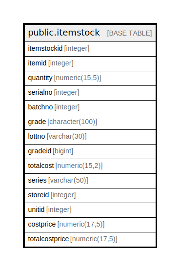

# public.itemstock

## Description

## Columns

| Name | Type | Default | Nullable | Children | Parents | Comment |
| ---- | ---- | ------- | -------- | -------- | ------- | ------- |
| itemstockid | integer | nextval('itemstock_itemstockid_seq'::regclass) | false |  |  |  |
| itemid | integer |  | true |  |  |  |
| quantity | numeric(15,5) |  | true |  |  |  |
| serialno | integer |  | true |  |  |  |
| batchno | integer | 0 | true |  |  |  |
| grade | character(100) |  | true |  |  |  |
| lottno | varchar(30) |  | true |  |  |  |
| gradeid | bigint |  | true |  |  |  |
| totalcost | numeric(15,2) |  | true |  |  |  |
| series | varchar(50) | 0 | true |  |  |  |
| storeid | integer |  | true |  |  |  |
| unitid | integer | 1 | true |  |  |  |
| costprice | numeric(17,5) | 0 | true |  |  |  |
| totalcostprice | numeric(17,5) | 0 | true |  |  |  |

## Relations

---

> Generated by [tbls](https://github.com/k1LoW/tbls)
