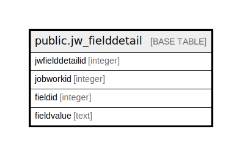

# public.jw_fielddetail

## Description

## Columns

| Name | Type | Default | Nullable | Children | Parents | Comment |
| ---- | ---- | ------- | -------- | -------- | ------- | ------- |
| jwfielddetailid | integer | nextval('jw_fielddetail_jwfielddetailid_seq'::regclass) | false |  |  |  |
| jobworkid | integer |  | true |  |  |  |
| fieldid | integer |  | true |  |  |  |
| fieldvalue | text |  | true |  |  |  |

## Constraints

| Name | Type | Definition |
| ---- | ---- | ---------- |
| jw_fielddetail_pkey | PRIMARY KEY | PRIMARY KEY (jwfielddetailid) |

## Indexes

| Name | Definition |
| ---- | ---------- |
| jw_fielddetail_pkey | CREATE UNIQUE INDEX jw_fielddetail_pkey ON public.jw_fielddetail USING btree (jwfielddetailid) |

## Triggers

| Name | Definition |
| ---- | ---------- |
| jobworkorder_amend_log_entry | CREATE TRIGGER jobworkorder_amend_log_entry BEFORE UPDATE ON public.jw_fielddetail FOR EACH ROW EXECUTE FUNCTION jobworkorder_amend_log_entry() |

## Relations

---

> Generated by [tbls](https://github.com/k1LoW/tbls)
