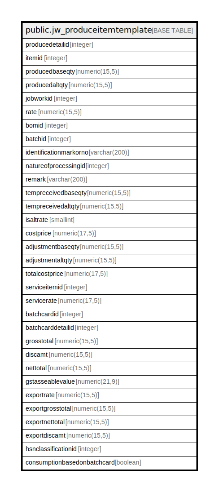

# public.jw_produceitemtemplate

## Description

## Columns

| Name | Type | Default | Nullable | Children | Parents | Comment |
| ---- | ---- | ------- | -------- | -------- | ------- | ------- |
| producedetailid | integer | nextval('jw_produceitemtemplate_producedetailid_seq'::regclass) | false |  |  |  |
| itemid | integer |  | true |  |  |  |
| producedbaseqty | numeric(15,5) |  | true |  |  |  |
| producedaltqty | numeric(15,5) |  | true |  |  |  |
| jobworkid | integer |  | true |  |  |  |
| rate | numeric(15,5) |  | true |  |  |  |
| bomid | integer |  | true |  |  |  |
| batchid | integer | 0 | true |  |  |  |
| identificationmarkorno | varchar(200) |  | true |  |  |  |
| natureofprocessingid | integer |  | true |  |  |  |
| remark | varchar(200) |  | true |  |  |  |
| tempreceivedbaseqty | numeric(15,5) |  | true |  |  |  |
| tempreceivedaltqty | numeric(15,5) |  | true |  |  |  |
| isaltrate | smallint | 0 | true |  |  |  |
| costprice | numeric(17,5) | 0 | true |  |  |  |
| adjustmentbaseqty | numeric(15,5) |  | true |  |  |  |
| adjustmentaltqty | numeric(15,5) |  | true |  |  |  |
| totalcostprice | numeric(17,5) | 0 | true |  |  |  |
| serviceitemid | integer |  | true |  |  |  |
| servicerate | numeric(17,5) |  | true |  |  |  |
| batchcardid | integer |  | true |  |  |  |
| batchcarddetailid | integer |  | true |  |  |  |
| grosstotal | numeric(15,5) | 0 | true |  |  |  |
| discamt | numeric(15,5) | 0 | true |  |  |  |
| nettotal | numeric(15,5) | 0 | true |  |  |  |
| gstasseablevalue | numeric(21,9) |  | true |  |  |  |
| exportrate | numeric(15,5) | 0 | true |  |  |  |
| exportgrosstotal | numeric(15,5) | 0 | true |  |  |  |
| exportnettotal | numeric(15,5) | 0 | true |  |  |  |
| exportdiscamt | numeric(15,5) | 0 | true |  |  |  |
| hsnclassificationid | integer |  | true |  |  |  |
| consumptionbasedonbatchcard | boolean | false | true |  |  |  |

## Constraints

| Name | Type | Definition |
| ---- | ---- | ---------- |
| jw_produceitemtemplate_pkey | PRIMARY KEY | PRIMARY KEY (producedetailid) |

## Indexes

| Name | Definition |
| ---- | ---------- |
| jw_produceitemtemplate_pkey | CREATE UNIQUE INDEX jw_produceitemtemplate_pkey ON public.jw_produceitemtemplate USING btree (producedetailid) |

## Triggers

| Name | Definition |
| ---- | ---------- |
| jobworkorder_amend_log_entry | CREATE TRIGGER jobworkorder_amend_log_entry BEFORE UPDATE ON public.jw_produceitemtemplate FOR EACH ROW EXECUTE FUNCTION jobworkorder_amend_log_entry() |

## Relations

---

> Generated by [tbls](https://github.com/k1LoW/tbls)
