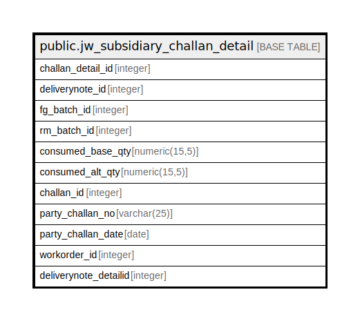

# public.jw_subsidiary_challan_detail

## Description

## Columns

| Name | Type | Default | Nullable | Children | Parents | Comment |
| ---- | ---- | ------- | -------- | -------- | ------- | ------- |
| challan_detail_id | integer | nextval('jw_subsidiary_challan_detail_challan_detail_id_seq'::regclass) | false |  |  |  |
| deliverynote_id | integer |  | true |  |  |  |
| fg_batch_id | integer |  | true |  |  |  |
| rm_batch_id | integer |  | true |  |  |  |
| consumed_base_qty | numeric(15,5) |  | true |  |  |  |
| consumed_alt_qty | numeric(15,5) |  | true |  |  |  |
| challan_id | integer |  | true |  |  |  |
| party_challan_no | varchar(25) |  | true |  |  |  |
| party_challan_date | date |  | true |  |  |  |
| workorder_id | integer |  | true |  |  |  |
| deliverynote_detailid | integer |  | true |  |  |  |

## Relations

---

> Generated by [tbls](https://github.com/k1LoW/tbls)
