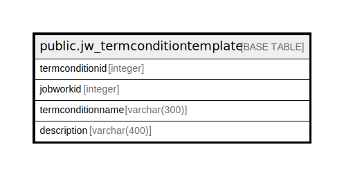

# public.jw_termconditiontemplate

## Description

## Columns

| Name | Type | Default | Nullable | Children | Parents | Comment |
| ---- | ---- | ------- | -------- | -------- | ------- | ------- |
| termconditionid | integer | nextval('jw_termconditiontemplate_termconditionid_seq'::regclass) | false |  |  |  |
| jobworkid | integer |  | true |  |  |  |
| termconditionname | varchar(300) |  | true |  |  |  |
| description | varchar(400) |  | true |  |  |  |

## Constraints

| Name | Type | Definition |
| ---- | ---- | ---------- |
| jw_termconditiontemplate_pkey | PRIMARY KEY | PRIMARY KEY (termconditionid) |

## Indexes

| Name | Definition |
| ---- | ---------- |
| jw_termconditiontemplate_pkey | CREATE UNIQUE INDEX jw_termconditiontemplate_pkey ON public.jw_termconditiontemplate USING btree (termconditionid) |

## Triggers

| Name | Definition |
| ---- | ---------- |
| jobworkorder_amend_log_entry | CREATE TRIGGER jobworkorder_amend_log_entry BEFORE UPDATE ON public.jw_termconditiontemplate FOR EACH ROW EXECUTE FUNCTION jobworkorder_amend_log_entry() |

## Relations

---

> Generated by [tbls](https://github.com/k1LoW/tbls)
