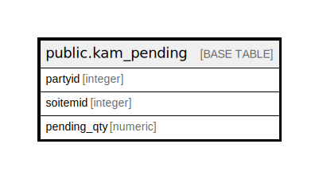

# public.kam_pending

## Description

## Columns

| Name | Type | Default | Nullable | Children | Parents | Comment |
| ---- | ---- | ------- | -------- | -------- | ------- | ------- |
| partyid | integer |  | true |  |  |  |
| soitemid | integer |  | true |  |  |  |
| pending_qty | numeric |  | true |  |  |  |

## Relations

---

> Generated by [tbls](https://github.com/k1LoW/tbls)
