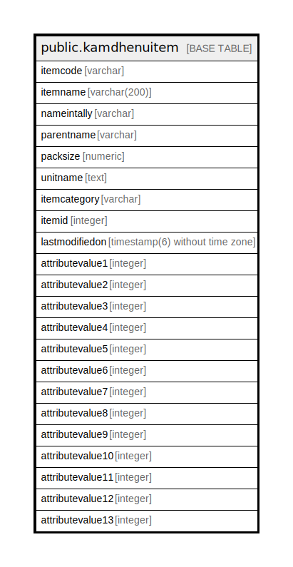

# public.kamdhenuitem

## Description

## Columns

| Name | Type | Default | Nullable | Children | Parents | Comment |
| ---- | ---- | ------- | -------- | -------- | ------- | ------- |
| itemcode | varchar |  | true |  |  |  |
| itemname | varchar(200) |  | true |  |  |  |
| nameintally | varchar |  | true |  |  |  |
| parentname | varchar |  | true |  |  |  |
| packsize | numeric |  | true |  |  |  |
| unitname | text |  | true |  |  |  |
| itemcategory | varchar |  | true |  |  |  |
| itemid | integer |  | true |  |  |  |
| lastmodifiedon | timestamp(6) without time zone |  | true |  |  |  |
| attributevalue1 | integer |  | true |  |  |  |
| attributevalue2 | integer |  | true |  |  |  |
| attributevalue3 | integer |  | true |  |  |  |
| attributevalue4 | integer |  | true |  |  |  |
| attributevalue5 | integer |  | true |  |  |  |
| attributevalue6 | integer |  | true |  |  |  |
| attributevalue7 | integer |  | true |  |  |  |
| attributevalue8 | integer |  | true |  |  |  |
| attributevalue9 | integer |  | true |  |  |  |
| attributevalue10 | integer |  | true |  |  |  |
| attributevalue11 | integer |  | true |  |  |  |
| attributevalue12 | integer |  | true |  |  |  |
| attributevalue13 | integer |  | true |  |  |  |

## Relations

---

> Generated by [tbls](https://github.com/k1LoW/tbls)
