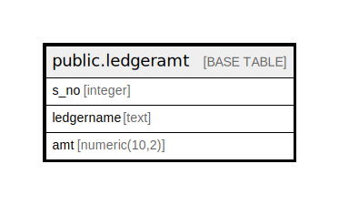

# public.ledgeramt

## Description

## Columns

| Name | Type | Default | Nullable | Children | Parents | Comment |
| ---- | ---- | ------- | -------- | -------- | ------- | ------- |
| s_no | integer |  | true |  |  |  |
| ledgername | text |  | true |  |  |  |
| amt | numeric(10,2) |  | true |  |  |  |

## Relations

---

> Generated by [tbls](https://github.com/k1LoW/tbls)
