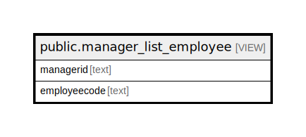

# public.manager_list_employee

## Description

<details>
<summary><strong>Table Definition</strong></summary>

```sql
CREATE VIEW manager_list_employee AS (
 SELECT t1.managerid,
    t1.employeecode
   FROM ((hr_employeeotherdetail t1
     JOIN hr_employeeotherdetail t2 ON ((t2.employeecode = t1.managerid)))
     LEFT JOIN hr_employeemaster t3 ON ((((t3.employeecode)::text = t1.employeecode) AND (t3.isactive = true) AND (COALESCE(t1.delflag, false) = false))))
  ORDER BY t1.managerid
)
```

</details>

## Columns

| Name | Type | Default | Nullable | Children | Parents | Comment |
| ---- | ---- | ------- | -------- | -------- | ------- | ------- |
| managerid | text |  | true |  |  |  |
| employeecode | text |  | true |  |  |  |

## Referenced Tables

| Name | Columns | Comment | Type |
| ---- | ------- | ------- | ---- |
| [public.hr_employeeotherdetail](public.hr_employeeotherdetail.md) | 19 |  | BASE TABLE |
| [public.hr_employeemaster](public.hr_employeemaster.md) | 137 |  | BASE TABLE |

## Relations



---

> Generated by [tbls](https://github.com/k1LoW/tbls)
