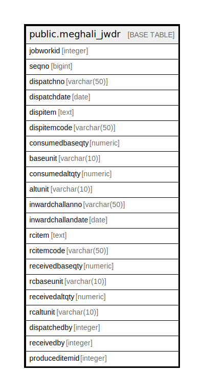

# public.meghali_jwdr

## Description

## Columns

| Name | Type | Default | Nullable | Children | Parents | Comment |
| ---- | ---- | ------- | -------- | -------- | ------- | ------- |
| jobworkid | integer |  | true |  |  |  |
| seqno | bigint |  | true |  |  |  |
| dispatchno | varchar(50) |  | true |  |  |  |
| dispatchdate | date |  | true |  |  |  |
| dispitem | text |  | true |  |  |  |
| dispitemcode | varchar(50) |  | true |  |  |  |
| consumedbaseqty | numeric |  | true |  |  |  |
| baseunit | varchar(10) |  | true |  |  |  |
| consumedaltqty | numeric |  | true |  |  |  |
| altunit | varchar(10) |  | true |  |  |  |
| inwardchallanno | varchar(50) |  | true |  |  |  |
| inwardchallandate | date |  | true |  |  |  |
| rcitem | text |  | true |  |  |  |
| rcitemcode | varchar(50) |  | true |  |  |  |
| receivedbaseqty | numeric |  | true |  |  |  |
| rcbaseunit | varchar(10) |  | true |  |  |  |
| receivedaltqty | numeric |  | true |  |  |  |
| rcaltunit | varchar(10) |  | true |  |  |  |
| dispatchedby | integer |  | true |  |  |  |
| receivedby | integer |  | true |  |  |  |
| produceditemid | integer |  | true |  |  |  |

## Relations

---

> Generated by [tbls](https://github.com/k1LoW/tbls)
