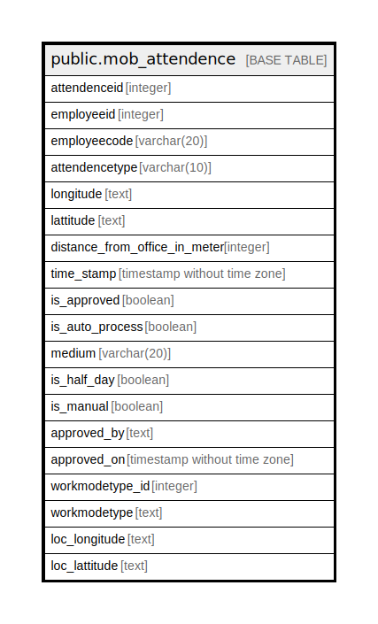

# public.mob_attendence

## Description

## Columns

| Name | Type | Default | Nullable | Children | Parents | Comment |
| ---- | ---- | ------- | -------- | -------- | ------- | ------- |
| attendenceid | integer | nextval('mob_attendence_attendenceid_seq'::regclass) | false |  |  |  |
| employeeid | integer |  | true |  |  |  |
| employeecode | varchar(20) |  | true |  |  |  |
| attendencetype | varchar(10) |  | true |  |  |  |
| longitude | text |  | true |  |  |  |
| lattitude | text |  | true |  |  |  |
| distance_from_office_in_meter | integer |  | true |  |  |  |
| time_stamp | timestamp without time zone |  | true |  |  |  |
| is_approved | boolean |  | true |  |  |  |
| is_auto_process | boolean |  | true |  |  |  |
| medium | varchar(20) |  | true |  |  |  |
| is_half_day | boolean |  | true |  |  |  |
| is_manual | boolean |  | true |  |  |  |
| approved_by | text |  | true |  |  |  |
| approved_on | timestamp without time zone |  | true |  |  |  |

## Relations

---

> Generated by [tbls](https://github.com/k1LoW/tbls)
