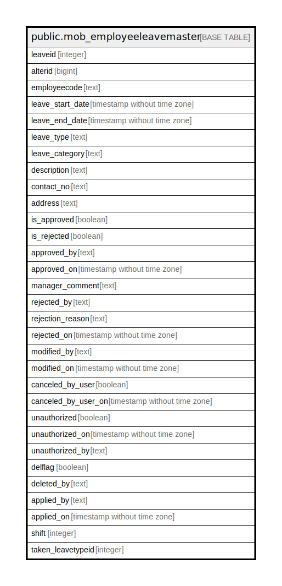

# public.mob_employeeleavemaster

## Description

## Columns

| Name | Type | Default | Nullable | Children | Parents | Comment |
| ---- | ---- | ------- | -------- | -------- | ------- | ------- |
| leaveid | integer | nextval('mob_employeeleavemaster_leaveid_seq'::regclass) | false |  |  |  |
| alterid | bigint |  | true |  |  |  |
| employeecode | text |  | true |  |  |  |
| leave_start_date | timestamp without time zone |  | true |  |  |  |
| leave_end_date | timestamp without time zone |  | true |  |  |  |
| leave_type | text |  | true |  |  |  |
| leave_category | text |  | true |  |  |  |
| description | text |  | true |  |  |  |
| contact_no | text |  | true |  |  |  |
| address | text |  | true |  |  |  |
| is_approved | boolean |  | true |  |  |  |
| is_rejected | boolean |  | true |  |  |  |
| approved_by | text |  | true |  |  |  |
| approved_on | timestamp without time zone |  | true |  |  |  |
| manager_comment | text |  | true |  |  |  |
| rejected_by | text |  | true |  |  |  |
| rejection_reason | text |  | true |  |  |  |
| rejected_on | timestamp without time zone |  | true |  |  |  |
| modified_by | text |  | true |  |  |  |
| modified_on | timestamp without time zone |  | true |  |  |  |
| canceled_by_user | boolean |  | true |  |  |  |
| canceled_by_user_on | timestamp without time zone |  | true |  |  |  |
| unauthorized | boolean |  | true |  |  |  |
| unauthorized_on | timestamp without time zone |  | true |  |  |  |
| unauthorized_by | text |  | true |  |  |  |
| delflag | boolean | false | true |  |  |  |
| deleted_by | text |  | true |  |  |  |
| applied_by | text |  | true |  |  |  |
| applied_on | timestamp without time zone |  | true |  |  |  |
| shift | integer |  | true |  |  |  |
| taken_leavetypeid | integer | 0 | true |  |  |  |

## Relations

---

> Generated by [tbls](https://github.com/k1LoW/tbls)
