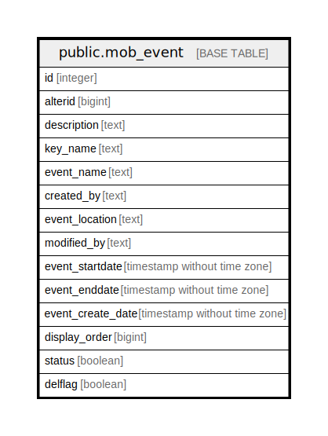

# public.mob_event

## Description

## Columns

| Name | Type | Default | Nullable | Children | Parents | Comment |
| ---- | ---- | ------- | -------- | -------- | ------- | ------- |
| id | integer | nextval('mob_event_id_seq'::regclass) | false |  |  |  |
| alterid | bigint |  | true |  |  |  |
| description | text |  | true |  |  |  |
| key_name | text |  | true |  |  |  |
| event_name | text |  | true |  |  |  |
| created_by | text |  | true |  |  |  |
| event_location | text |  | true |  |  |  |
| modified_by | text |  | true |  |  |  |
| event_startdate | timestamp without time zone |  | true |  |  |  |
| event_enddate | timestamp without time zone |  | true |  |  |  |
| event_create_date | timestamp without time zone | now() | true |  |  |  |
| display_order | bigint |  | true |  |  |  |
| status | boolean |  | true |  |  |  |
| delflag | boolean |  | true |  |  |  |

## Triggers

| Name | Definition |
| ---- | ---------- |
| mob_updatealterid | CREATE TRIGGER mob_updatealterid AFTER INSERT OR UPDATE ON public.mob_event FOR EACH ROW EXECUTE FUNCTION mob_updatealterid() |

## Relations

---

> Generated by [tbls](https://github.com/k1LoW/tbls)
