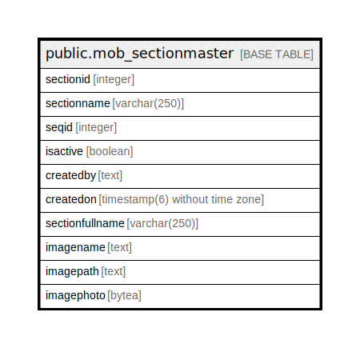

# public.mob_sectionmaster

## Description

## Columns

| Name | Type | Default | Nullable | Children | Parents | Comment |
| ---- | ---- | ------- | -------- | -------- | ------- | ------- |
| sectionid | integer | nextval('mob_sectionmaster_sectionid_seq'::regclass) | false |  |  |  |
| sectionname | varchar(250) |  | true |  |  |  |
| seqid | integer |  | true |  |  |  |
| isactive | boolean | false | true |  |  |  |
| createdby | text |  | true |  |  |  |
| createdon | timestamp(6) without time zone | now() | true |  |  |  |
| sectionfullname | varchar(250) |  | true |  |  |  |
| imagename | text |  | true |  |  |  |
| imagepath | text |  | true |  |  |  |
| imagephoto | bytea |  | true |  |  |  |

## Constraints

| Name | Type | Definition |
| ---- | ---- | ---------- |
| mob_sectionmaster_pkey | PRIMARY KEY | PRIMARY KEY (sectionid) |

## Indexes

| Name | Definition |
| ---- | ---------- |
| mob_sectionmaster_pkey | CREATE UNIQUE INDEX mob_sectionmaster_pkey ON public.mob_sectionmaster USING btree (sectionid) |

## Relations

---

> Generated by [tbls](https://github.com/k1LoW/tbls)
