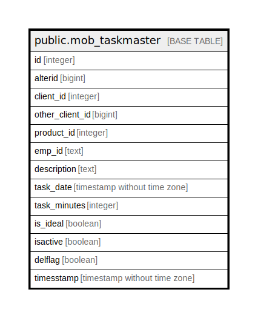

# public.mob_taskmaster

## Description

## Columns

| Name | Type | Default | Nullable | Children | Parents | Comment |
| ---- | ---- | ------- | -------- | -------- | ------- | ------- |
| id | integer | nextval('mob_taskmaster_id_seq'::regclass) | false |  |  |  |
| alterid | bigint |  | true |  |  |  |
| client_id | integer |  | true |  |  |  |
| other_client_id | bigint |  | true |  |  |  |
| product_id | integer |  | true |  |  |  |
| emp_id | text |  | true |  |  |  |
| description | text |  | true |  |  |  |
| task_date | timestamp without time zone |  | true |  |  |  |
| task_minutes | integer |  | true |  |  |  |
| is_ideal | boolean |  | true |  |  |  |
| isactive | boolean |  | true |  |  |  |
| delflag | boolean |  | true |  |  |  |
| timesstamp | timestamp without time zone |  | true |  |  |  |

## Triggers

| Name | Definition |
| ---- | ---------- |
| mob_updatealterid | CREATE TRIGGER mob_updatealterid AFTER INSERT OR UPDATE ON public.mob_taskmaster FOR EACH ROW EXECUTE FUNCTION mob_updatealterid() |

## Relations

---

> Generated by [tbls](https://github.com/k1LoW/tbls)
