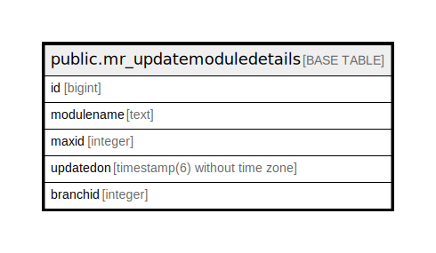

# public.mr_updatemoduledetails

## Description

## Columns

| Name | Type | Default | Nullable | Children | Parents | Comment |
| ---- | ---- | ------- | -------- | -------- | ------- | ------- |
| id | bigint | nextval('mr_updatemoduledetails_id_seq'::regclass) | false |  |  |  |
| modulename | text |  | true |  |  |  |
| maxid | integer |  | true |  |  |  |
| updatedon | timestamp(6) without time zone | now() | true |  |  |  |
| branchid | integer |  | true |  |  |  |

## Constraints

| Name | Type | Definition |
| ---- | ---- | ---------- |
| mr_updatemoduledetails_pkey | PRIMARY KEY | PRIMARY KEY (id) |

## Indexes

| Name | Definition |
| ---- | ---------- |
| mr_updatemoduledetails_pkey | CREATE UNIQUE INDEX mr_updatemoduledetails_pkey ON public.mr_updatemoduledetails USING btree (id) |

## Relations

---

> Generated by [tbls](https://github.com/k1LoW/tbls)
