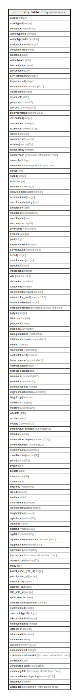

# public.my_table_copy

## Description

## Columns

| Name | Type | Default | Nullable | Children | Parents | Comment |
| ---- | ---- | ------- | -------- | -------- | ------- | ------- |
| assetid | integer |  | true |  |  |  |
| assettypeid | integer |  | true |  |  |  |
| serialcode | varchar(50) |  | true |  |  |  |
| warrantyperiod | integer |  | true |  |  |  |
| warrantyperiodin | smallint |  | true |  |  |  |
| assignedtoempid | integer |  | true |  |  |  |
| dateofpurchase | date |  | true |  |  |  |
| dateofuse | date |  | true |  |  |  |
| warrantydate | date |  | true |  |  |  |
| amcperiodfrom | date |  | true |  |  |  |
| amcperiodto | date |  | true |  |  |  |
| servicefrequency | integer |  | true |  |  |  |
| frequencyunit | integer |  | true |  |  |  |
| annualpremium | numeric(20,2) |  | true |  |  |  |
| insperiodfrom | date |  | true |  |  |  |
| insperiodto | date |  | true |  |  |  |
| policyno | varchar(20) |  | true |  |  |  |
| amccost | numeric(20,2) |  | true |  |  |  |
| policycoverage | numeric(20,2) |  | true |  |  |  |
| insvenderid | integer |  | true |  |  |  |
| amcvenderid | integer |  | true |  |  |  |
| assetcost | numeric(20,2) |  | true |  |  |  |
| isactive | boolean |  | true |  |  |  |
| isauthorized | boolean |  | true |  |  |  |
| serialno | varchar(50) |  | true |  |  |  |
| authorizedby | integer |  | true |  |  |  |
| authorizedon | timestamp without time zone |  | true |  |  |  |
| createdby | integer |  | true |  |  |  |
| createdon | timestamp without time zone |  | true |  |  |  |
| editlog | text |  | true |  |  |  |
| itactid | integer |  | true |  |  |  |
| actid | integer |  | true |  |  |  |
| addlrate | numeric(5,2) |  | true |  |  |  |
| allowfulldepreciation | boolean |  | true |  |  |  |
| depreciationid | integer |  | true |  |  |  |
| dateofmanufacturing | date |  | true |  |  |  |
| dateofexpiry | date |  | true |  |  |  |
| lifeofasset | numeric(15,2) |  | true |  |  |  |
| dateofimport | date |  | true |  |  |  |
| batchno | varchar(20) |  | true |  |  |  |
| seriescode | varchar(50) |  | true |  |  |  |
| seriesno | integer |  | true |  |  |  |
| poid | integer |  | true |  |  |  |
| inspectionitemid | integer |  | true |  |  |  |
| salvagevalue | numeric(20,2) |  | true |  |  |  |
| itemid | integer |  | true |  |  |  |
| manufacturer | integer |  | true |  |  |  |
| branchid | integer |  | true |  |  |  |
| inspectionid | integer |  | true |  |  |  |
| wdv | numeric(15,2) |  | true |  |  |  |
| depmethod | smallint |  | true |  |  |  |
| isaddlrate | boolean |  | true |  |  |  |
| isconsumableissued | boolean |  | true |  |  |  |
| currentvalue_itact | numeric(15,2) |  | true |  |  |  |
| headauthorizedby | integer |  | true |  |  |  |
| headauthorizedon | timestamp without time zone |  | true |  |  |  |
| partyid | integer |  | true |  |  |  |
| billno | varchar(50) |  | true |  |  |  |
| purposeid | integer |  | true |  |  |  |
| chasisno | varchar(50) |  | true |  |  |  |
| oldregistrationno | varchar(50) |  | true |  |  |  |
| totalpurchasecost | numeric(20,2) |  | true |  |  |  |
| bankid | smallint |  | true |  |  |  |
| loannumber | varchar(50) |  | true |  |  |  |
| noofinstallment | smallint |  | true |  |  |  |
| financeamount | numeric(10,2) |  | true |  |  |  |
| financestartdate | date |  | true |  |  |  |
| financeclosedate | date |  | true |  |  |  |
| emiamount | numeric(20,2) |  | true |  |  |  |
| paidstatus | varchar(50) |  | true |  |  |  |
| currentlocationid | integer |  | true |  |  |  |
| engineormachineno | varchar(50) |  | true |  |  |  |
| isagainstpi | boolean |  | true |  |  |  |
| model | varchar(100) |  | true |  |  |  |
| modelno | varchar(100) |  | true |  |  |  |
| wdvdate | date |  | true |  |  |  |
| depdate | date |  | true |  |  |  |
| deprate | numeric(5,2) |  | true |  |  |  |
| currentvalue_compact | numeric(15,2) |  | true |  |  |  |
| remarks | varchar |  | true |  |  |  |
| currentvaluecompact | numeric(15,2) |  | true |  |  |  |
| currentvalueitact | numeric(8,2) |  | true |  |  |  |
| assetserialno | varchar(50) |  | true |  |  |  |
| assetbatchno | varchar(50) |  | true |  |  |  |
| pono | varchar(50) |  | true |  |  |  |
| podate | date |  | true |  |  |  |
| billdate | date |  | true |  |  |  |
| rcno | varchar(50) |  | true |  |  |  |
| rcdate | date |  | true |  |  |  |
| engineno | varchar(50) |  | true |  |  |  |
| issold | boolean |  | true |  |  |  |
| solddate | date |  | true |  |  |  |
| invoicedetailid | integer |  | true |  |  |  |
| iscomponentasset | boolean |  | true |  |  |  |
| isdgdefinition | boolean |  | true |  |  |  |
| dgfueltype | varchar(50) |  | true |  |  |  |
| dgunitid | integer |  | true |  |  |  |
| dgbrand | varchar(100) |  | true |  |  |  |
| dgstatus | varchar(50) |  | true |  |  |  |
| dgperhourfuelconsumption | numeric(18,4) |  | true |  |  |  |
| dgspecification | varchar(200) |  | true |  |  |  |
| dgremarks | varchar(255) |  | true |  |  |  |
| inactivedate | timestamp without time zone |  | true |  |  |  |
| oldassetcode | varchar(50) |  | true |  |  |  |
| entity | text |  | true |  |  |  |
| parent_asset_type_id | integer |  | true |  |  |  |
| parent_asset_id | integer |  | true |  |  |  |
| attachby_id | integer |  | true |  |  |  |
| attachby_date | date |  | true |  |  |  |
| rate_shift_id | integer |  | true |  |  |  |
| applicable_frm | date |  | true |  |  |  |
| isdepreciationcalculated | boolean |  | true |  |  |  |
| assetstatusid | integer |  | true |  |  |  |
| ownershiptypeid | integer |  | true |  |  |  |
| takeoverdetailid | integer |  | true |  |  |  |
| handoverdetailid | integer |  | true |  |  |  |
| istakeover | boolean |  | true |  |  |  |
| istransfered | boolean |  | true |  |  |  |
| transferdate | date |  | true |  |  |  |
| wdvrate | numeric(20,2) |  | true |  |  |  |
| currentbranchid | integer |  | true |  |  |  |
| assetstatusnotinusedate | timestamp without time zone |  | true |  |  |  |
| modeldate | date |  | true |  |  |  |
| vendorserialcode | varchar(100) |  | true |  |  |  |
| assetentrydate | timestamp without time zone |  | true |  |  |  |
| consumableassetopening | numeric(15,2) |  | true |  |  |  |
| updatedby | integer |  | true |  |  |  |
| updatedon | timestamp(6) without time zone |  | true |  |  |  |

## Relations

---

> Generated by [tbls](https://github.com/k1LoW/tbls)
