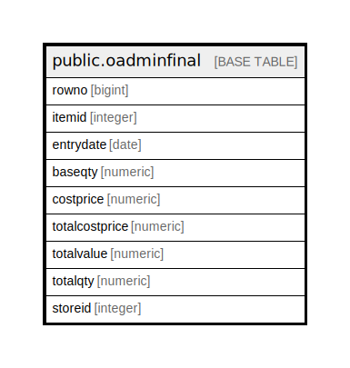

# public.oadminfinal

## Description

## Columns

| Name | Type | Default | Nullable | Children | Parents | Comment |
| ---- | ---- | ------- | -------- | -------- | ------- | ------- |
| rowno | bigint |  | true |  |  |  |
| itemid | integer |  | true |  |  |  |
| entrydate | date |  | true |  |  |  |
| baseqty | numeric |  | true |  |  |  |
| costprice | numeric |  | true |  |  |  |
| totalcostprice | numeric |  | true |  |  |  |
| totalvalue | numeric |  | true |  |  |  |
| totalqty | numeric |  | true |  |  |  |
| storeid | integer |  | true |  |  |  |

## Relations

---

> Generated by [tbls](https://github.com/k1LoW/tbls)
