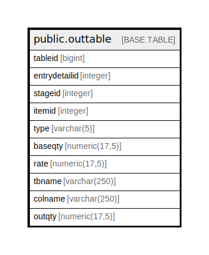

# public.outtable

## Description

## Columns

| Name | Type | Default | Nullable | Children | Parents | Comment |
| ---- | ---- | ------- | -------- | -------- | ------- | ------- |
| tableid | bigint | nextval('outtable_seq'::regclass) | false |  |  |  |
| entrydetailid | integer |  | true |  |  |  |
| stageid | integer |  | true |  |  |  |
| itemid | integer |  | true |  |  |  |
| type | varchar(5) |  | true |  |  |  |
| baseqty | numeric(17,5) |  | true |  |  |  |
| rate | numeric(17,5) |  | true |  |  |  |
| tbname | varchar(250) |  | true |  |  |  |
| colname | varchar(250) |  | true |  |  |  |
| outqty | numeric(17,5) |  | true |  |  |  |

## Relations

---

> Generated by [tbls](https://github.com/k1LoW/tbls)
