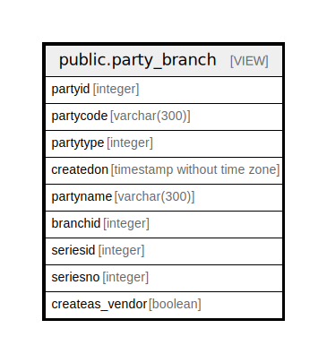

# public.party_branch

## Description

<details>
<summary><strong>Table Definition</strong></summary>

```sql
CREATE VIEW party_branch AS (
 SELECT t1.partyid,
    t1.partycode,
    t1.partytype,
    t1.createdon,
    t1.partyname,
    t2.branchid,
    t1.seriesid,
    t1.seriesno,
    t1.createas_vendor
   FROM (comn_partymaster t1
     JOIN comn_partybelongstobranch t2 ON ((t1.partyid = t2.partyid)))
)
```

</details>

## Columns

| Name | Type | Default | Nullable | Children | Parents | Comment |
| ---- | ---- | ------- | -------- | -------- | ------- | ------- |
| partyid | integer |  | true |  |  |  |
| partycode | varchar(300) |  | true |  |  |  |
| partytype | integer |  | true |  |  |  |
| createdon | timestamp without time zone |  | true |  |  |  |
| partyname | varchar(300) |  | true |  |  |  |
| branchid | integer |  | true |  |  |  |
| seriesid | integer |  | true |  |  |  |
| seriesno | integer |  | true |  |  |  |
| createas_vendor | boolean |  | true |  |  |  |

## Referenced Tables

| Name | Columns | Comment | Type |
| ---- | ------- | ------- | ---- |
| [public.comn_partymaster](public.comn_partymaster.md) | 120 |  | BASE TABLE |
| [public.comn_partybelongstobranch](public.comn_partybelongstobranch.md) | 13 |  | BASE TABLE |

## Relations



---

> Generated by [tbls](https://github.com/k1LoW/tbls)
