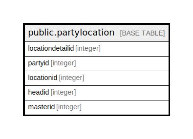

# public.partylocation

## Description

## Columns

| Name | Type | Default | Nullable | Children | Parents | Comment |
| ---- | ---- | ------- | -------- | -------- | ------- | ------- |
| locationdetailid | integer | nextval('partylocation_locationdetailid_seq'::regclass) | false |  |  |  |
| partyid | integer |  | true |  |  |  |
| locationid | integer |  | true |  |  |  |
| headid | integer |  | true |  |  |  |
| masterid | integer |  | true |  |  |  |

## Constraints

| Name | Type | Definition |
| ---- | ---- | ---------- |
| partylocation_pkey | PRIMARY KEY | PRIMARY KEY (locationdetailid) |

## Indexes

| Name | Definition |
| ---- | ---------- |
| partylocation_pkey | CREATE UNIQUE INDEX partylocation_pkey ON public.partylocation USING btree (locationdetailid) |

## Relations

---

> Generated by [tbls](https://github.com/k1LoW/tbls)
