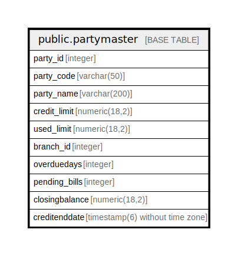

# public.partymaster

## Description

## Columns

| Name | Type | Default | Nullable | Children | Parents | Comment |
| ---- | ---- | ------- | -------- | -------- | ------- | ------- |
| party_id | integer |  | true |  |  |  |
| party_code | varchar(50) |  | true |  |  |  |
| party_name | varchar(200) |  | true |  |  |  |
| credit_limit | numeric(18,2) |  | true |  |  |  |
| used_limit | numeric(18,2) |  | true |  |  |  |
| branch_id | integer |  | true |  |  |  |
| overduedays | integer |  | true |  |  |  |
| pending_bills | integer |  | true |  |  |  |
| closingbalance | numeric(18,2) |  | true |  |  |  |
| creditenddate | timestamp(6) without time zone |  | true |  |  |  |

## Relations

---

> Generated by [tbls](https://github.com/k1LoW/tbls)
