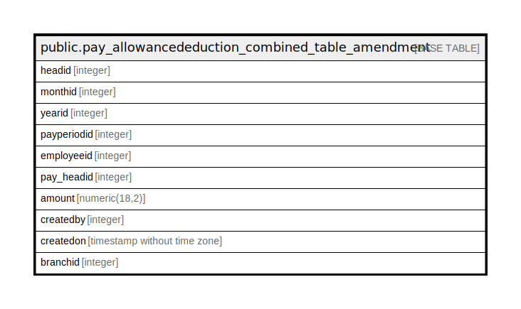

# public.pay_allowancededuction_combined_table_amendment

## Description

## Columns

| Name | Type | Default | Nullable | Children | Parents | Comment |
| ---- | ---- | ------- | -------- | -------- | ------- | ------- |
| headid | integer | nextval('pay_allowancededuction_combined_table_amendment_headid_seq'::regclass) | false |  |  |  |
| monthid | integer |  | false |  |  |  |
| yearid | integer |  | true |  |  |  |
| payperiodid | integer |  | true |  |  |  |
| employeeid | integer |  | true |  |  |  |
| pay_headid | integer |  | true |  |  |  |
| amount | numeric(18,2) |  | true |  |  |  |
| createdby | integer |  | true |  |  |  |
| createdon | timestamp without time zone | now() | true |  |  |  |
| branchid | integer |  | true |  |  |  |

## Constraints

| Name | Type | Definition |
| ---- | ---- | ---------- |
| pay_allowancededuction_combined_table_amend | PRIMARY KEY | PRIMARY KEY (headid) |

## Indexes

| Name | Definition |
| ---- | ---------- |
| pay_allowancededuction_combined_table_amend | CREATE UNIQUE INDEX pay_allowancededuction_combined_table_amend ON public.pay_allowancededuction_combined_table_amendment USING btree (headid) |

## Relations

---

> Generated by [tbls](https://github.com/k1LoW/tbls)
