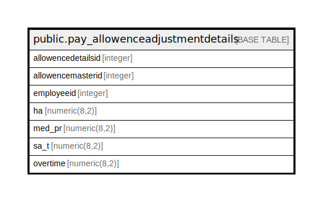

# public.pay_allowenceadjustmentdetails

## Description

## Columns

| Name | Type | Default | Nullable | Children | Parents | Comment |
| ---- | ---- | ------- | -------- | -------- | ------- | ------- |
| allowencedetailsid | integer | nextval('pay_allowenceadjustmentdetails_allowencedetailsid_seq'::regclass) | false |  |  |  |
| allowencemasterid | integer |  | true |  |  |  |
| employeeid | integer |  | true |  |  |  |
| ba | numeric(8,2) |  | true |  |  |  |

## Constraints

| Name | Type | Definition |
| ---- | ---- | ---------- |
| pay_allowenceadjustmentdetails_pkey | PRIMARY KEY | PRIMARY KEY (allowencedetailsid) |

## Indexes

| Name | Definition |
| ---- | ---------- |
| pay_allowenceadjustmentdetails_pkey | CREATE UNIQUE INDEX pay_allowenceadjustmentdetails_pkey ON public.pay_allowenceadjustmentdetails USING btree (allowencedetailsid) |

## Relations

---

> Generated by [tbls](https://github.com/k1LoW/tbls)
